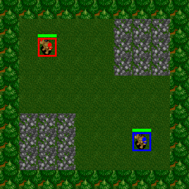
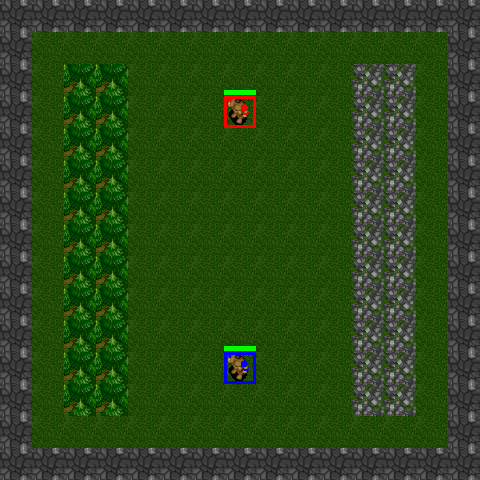
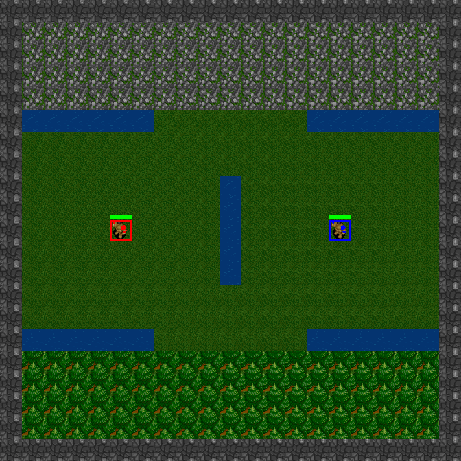
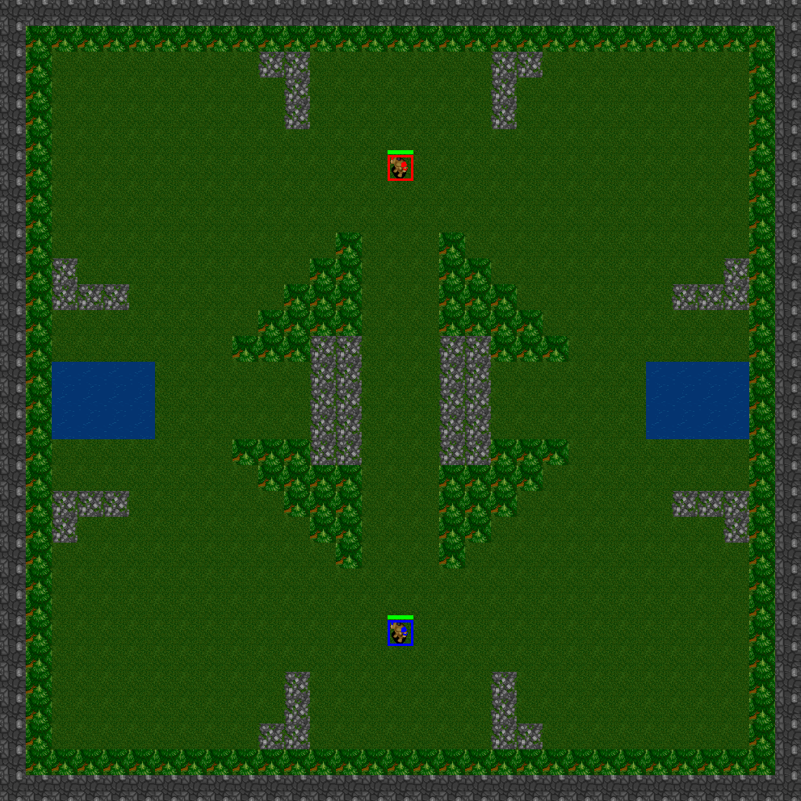

## Description [](https://travis-ci.org/cair/deep-rts) [](https://cair.github.io/deep-rts) [](https://raw.githubusercontent.com/cair/DeepRTS/c%2B%2B/LICENCE.MIT)
DeepRTS is a high-performance Real-TIme strategy game for Reinforcement Learning research. 
It is written in C++ for performance, 
but provides an python interface to better interface with machine-learning toolkits. 
Deep RTS can process the game with over **6 000 000** steps per second and **2 000 000** steps when rendering graphics.
In comparison to other solutions, such as StarCraft, this is over **15 000% faster simulation** time running on Intel i7-8700k with Nvidia RTX 2080 TI.

The aim of Deep RTS is to bring a more affordable and sustainable solution to RTS AI research by reducing computation time.

It is recommended to use the master-branch for the newest (and usually best) version of the environment. I am greatful for any input in regards to improving the environment.


Please use the following citation when using this in your work!
```
@INPROCEEDINGS{8490409,
author={P. {Andersen} and M. {Goodwin} and O. {Granmo}},
booktitle={2018 IEEE Conference on Computational Intelligence and Games (CIG)},
title={Deep RTS: A Game Environment for Deep Reinforcement Learning in Real-Time Strategy Games},
year={2018},
volume={},
number={},
pages={1-8},
keywords={computer games;convolution;feedforward neural nets;learning (artificial intelligence);multi-agent systems;high-performance RTS game;artificial intelligence research;deep reinforcement learning;real-time strategy games;computer games;RTS AIs;Deep RTS game environment;StarCraft II;Deep Q-Network agent;cutting-edge artificial intelligence algorithms;Games;Learning (artificial intelligence);Machine learning;Planning;Ground penetrating radar;Geophysical measurement techniques;real-time strategy game;deep reinforcement learning;deep q-learning},
doi={10.1109/CIG.2018.8490409},
ISSN={2325-4270},
month={Aug},}
```


## Dependencies

* Python >= 3.9.1

# Installation

### Method 1 (From Git Repo)
```
sudo pip3 install git+https://github.com/cair/DeepRTS.git
```

### Method 2 (Clone & Build)
```
git clone https://github.com/cair/deep-rts.git
cd deep-rts
git submodule sync
git submodule update --init
sudo pip3 install .
```

# Available maps
```
10x10-2-FFA
15x15-2-FFA
21x21-2-FFA
31x31-2-FFA
31x31-4-FFA
31x31-6-FFA
```

# Scenarios
Deep RTS features scenarios which is pre-built mini-games.
These mini-games is well suited to train agents on specific tasks, 
or to test algorithms in different problem setups.
The benefits of using scenarios is that you can trivially design reward functions using criterias that each outputs a reward/punishment signal depending on completion of the task.
Examples of tasks are to:
* collect 1000 gold
* do 100 damage
* take 1000 damage
* defeat 5 enemies

Deep RTS currently implements the following scenarios
```
GoldCollectFifteen
GeneralAIOneVersusOne
```

# Minimal Example
```python
import random
from DeepRTS.python import Config
from DeepRTS.python import scenario

if __name__ == "__main__":
    random_play = True
    episodes = 100

    for i in range(episodes):
        env = scenario.GeneralAI_1v1(Config.Map.THIRTYONE)
        state = env.reset()
        done = False

        while not done:
            env.game.set_player(env.game.players[0])
            action = random.randrange(15)
            next_state, reward, done, _ = env.step(action)
            state = next_state

            if (done):
                break

            env.game.set_player(env.game.players[1])
            action = random.randrange(15)
            next_state, reward, done, _ = env.step(action)
            state = next_state

```
# In-Game Footage

### 10x10 - 2 Player - free-for-all


### 15x15 - 2 Player - free-for-all


### 21x21 - 2 Player - free-for-all


### 31x31 - 2 Player - free-for-all


### 31x31 - 4 Player - free-for-all


### 31x3 - 6 Player - free-for-all

