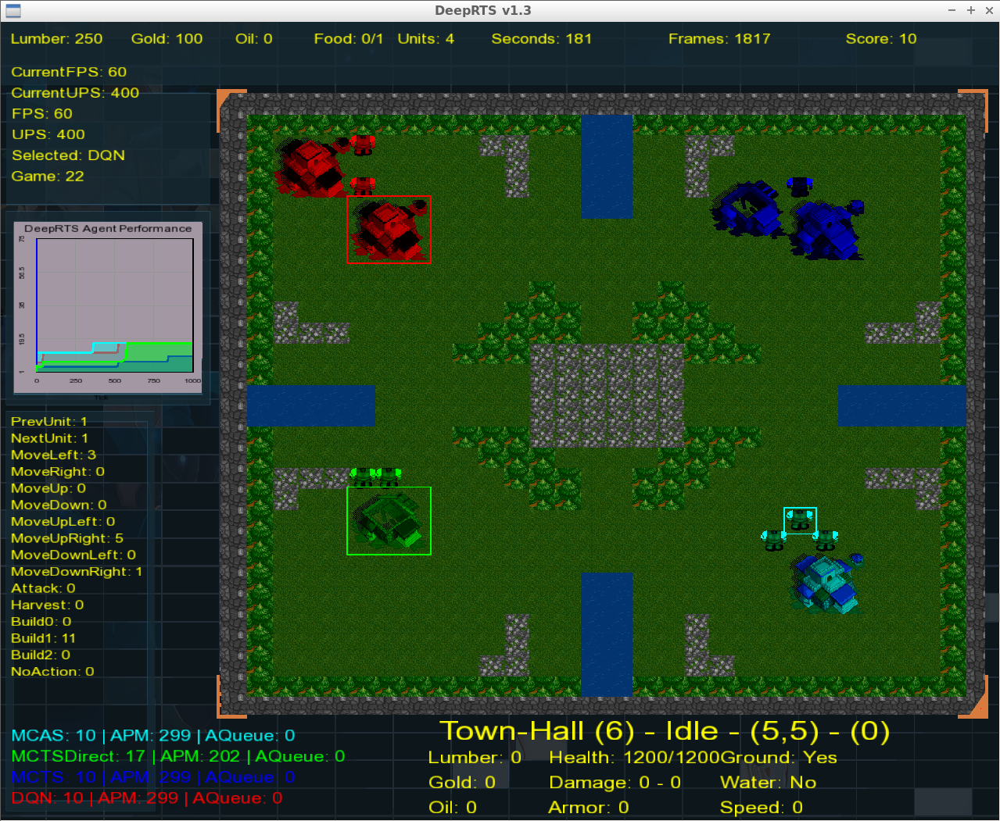

# DeepRTS     

A Real-Time Strategy Simulator for (Deep) Reinforment Learning in C++ and Python!

## External Dependencies
* SFML - Graphical Library for demonstration and debugging
* (optional) Python 3.x - API for Scientific artificial intelligence development

