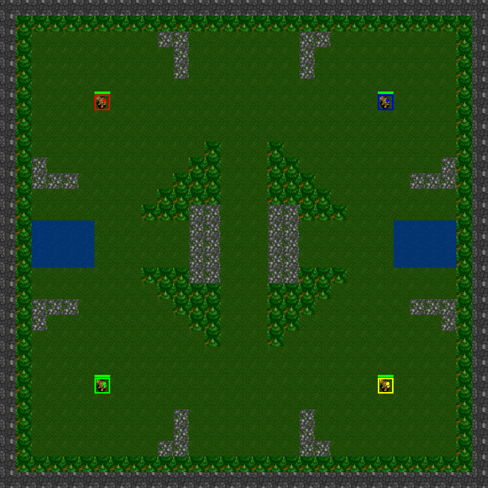
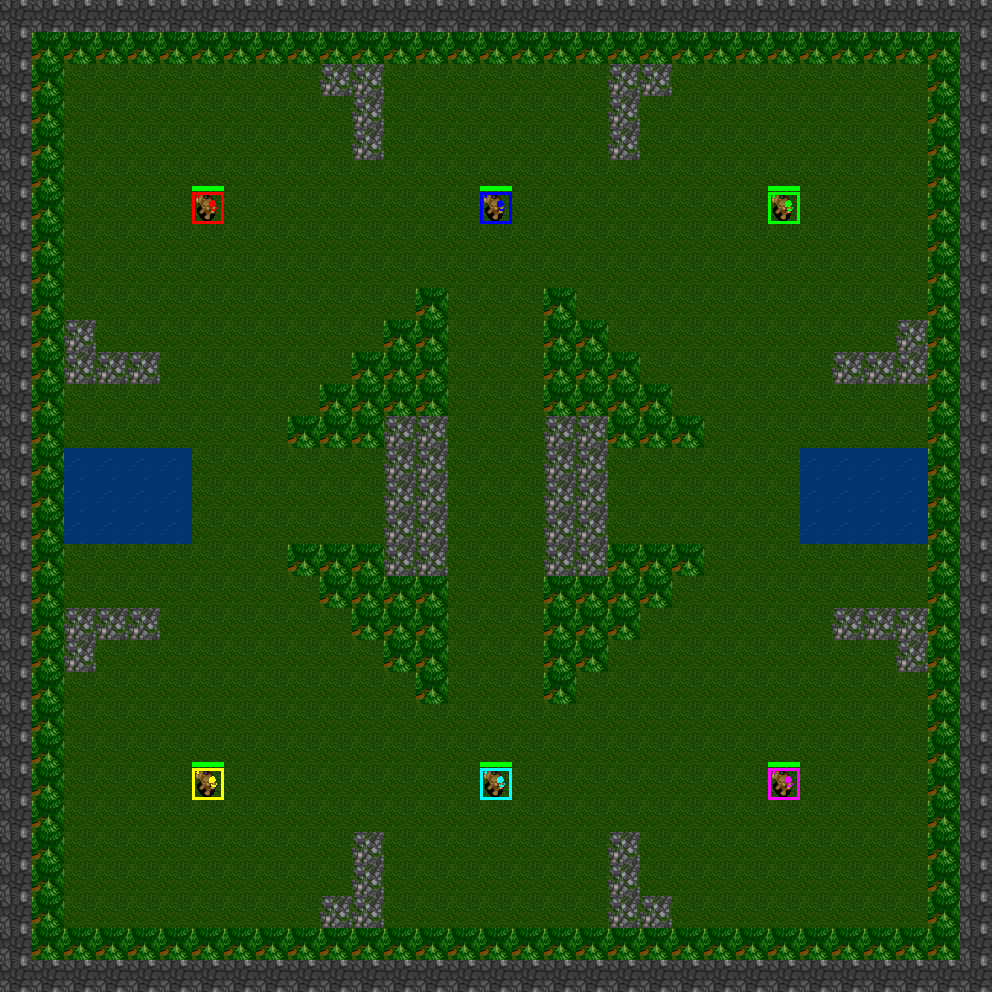

<p align="center">
  
</p>

A Real-Time Strategy Simulator for (Deep) Reinforment Learning in Python and C++!

## Description [](https://travis-ci.org/UIA-CAIR/DeepRTS) [](https://circleci.com/gh/UIA-CAIR/DeepRTS/tree/c%2B%2B) [](https://github.com/UIA-CAIR/DeepRTS/blob/c%2B%2B/docs/README.md) [](https://raw.githubusercontent.com/UIA-CAIR/DeepRTS/c%2B%2B/LICENCE.MIT)


## Dependencies

* Python >= 3.x

# Installation
```
sudo pip3 git+https://github.com/UIA-CAIR/DeepRTS
```
# Available maps
```
10x10-2-FFA
15x15-2-FFA
21x21-2-FFA
31x31-2-FFA
31x31-4-FFA
31x31-6-FFA
```

# Example
```python
import numpy

from pyDeepRTS import PyDeepRTS

# Start the game
g = PyDeepRTS()

# Add players
player1 = g.add_player()
player2 = g.add_player()

# Set FPS and UPS limits
g.set_max_fps(10000000)
g.set_max_ups(10000000)

# How often the state should be drawn
g.render_every(50)

# How often the capture function should return a state
g.capture_every(50)

# How often the game image should be drawn to the screen
g.view_every(50)

# Start the game (flag)
g.start()

# Run forever
while True:
    g.tick()  # Update the game clock
    g.update()  # Process the game state
    g.render()  # Draw the game state to graphics
    state = g.capture()  # Captures current state (Returns None if .capture_every is set for some iterations)
    g.caption()  # Show Window caption

    g.view()  # View the game state in the pygame window
    
    # If the game is in terminal state
    if g.is_terminal():
        g.reset()  # Reset the game

    # Perform random action for player 1
    player1.queue_action(numpy.random.randint(0, 16), 1)
    
    # Perform random action for player 2
    player2.queue_action(numpy.random.randint(0, 16), 1)
```
# In-Game Footage

### 10x10 - 2 Player - free-for-all


### 15x15 - 2 Player - free-for-all


### 21x21 - 2 Player - free-for-all


### 31x31 - 2 Player - free-for-all


### 31x31 - 4 Player - free-for-all


### 31x3 - 6 Player - free-for-all

