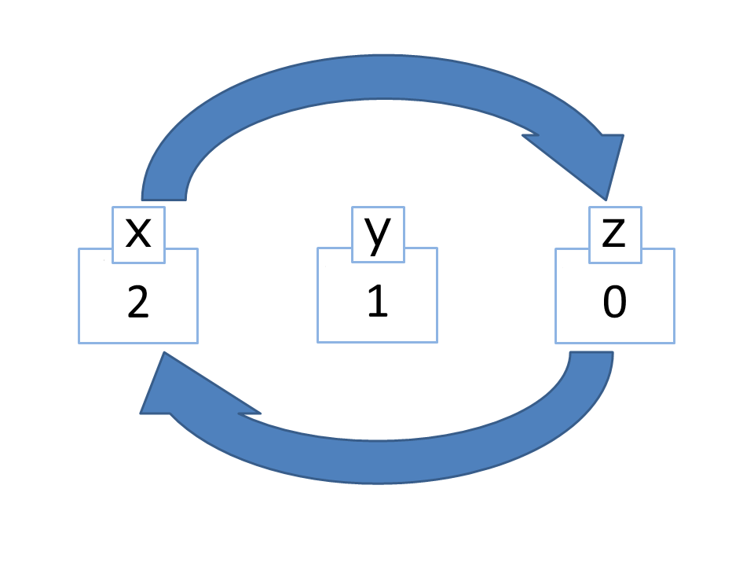

# RemoteAPI - PyAPI
PyApi enables machine learning in the C++ version by exposing itself via
the C API defined by the python library. This api has been tested 
with following python versions:
* Python 3.6.0
* Python 3.5.0

Other versions may work (And probably will), but they are not tested.

### Behind the scenes
The api are located in PyAI.cpp and PyAI.h

Initially, main.cpp calls PyAI::init() which initializes the Python environment
The environment are separated from the main thread so that the game can function
without any mentionable cpu loss.
 
After the interpreter has loaded all dependencies (Tensorflow, Keras, etc...)
it sends a PyAPIRegistry.loaded() call to the C++ side which sets the PyAPI::loaded
flag. When this flag is set, the game continues to load. (PyAI loads first so that 
it is ready at game start).

As mentioned, **PyAPIRegistry** is a static namespace which is injected directly into
the python base module. sinde PyAPIRegistry is static, the PyAI context is not recieved
by C++ so you MUST use gameID and playerID (these are hooked to PyAI) when requesting
states and issuing commands. This _may_ be changed in the future.

Calling **PyAPIRegistry.get_state(self.__ai__)** fires the get_state method in C++
This fetches current tile situation (and parses data of units and players where there any data to parse)
A int* are constructed with MAP_COLUMNS * MAP_ROWS * FEATURES size. FEATURES represent
number of elements (for example goldYield, lumberYield, unitID etc).

Tiles are then iterated through (30 * 30 on standard map) and all of the features 
are casted to (int) and added to the flat buffer. (Yes this is really just a **flat**buffer! which have mutable power!)
When this process is done the the following Tuple are sent back to python:
* buf_ptr
* buf_size
* rows
* cols
* depth

When this are retrieved at the python side, a memory-view is created.
This view is then parsed by numpy into a 3d array. The object is then returned
to the caller (End of callstack).

This allows for relatively fast transfer of states (27000 on my laptop I7 4700MQ)

## Numpy terms

And also worth mentioning what a transpose is:

Transpose are done after the numpy array are reshaped from 1D to 3D

