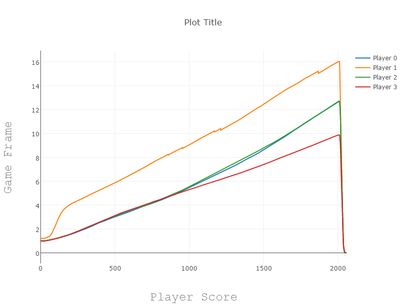
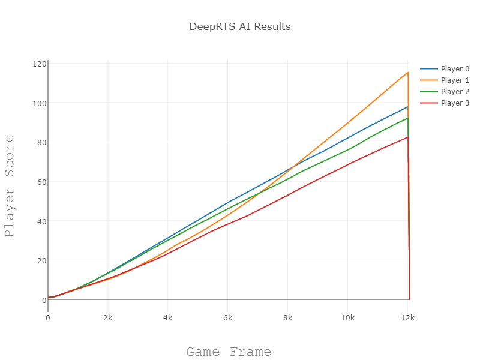

# Deep Q-Network - Initial Results
These are the initial restults when first setting up the python binding

The following action set were defined:
```cpp
enum Action {
    PreviousUnit = 1,
    NextUnit = 2,
    RightLeft = 3,
    RightRight = 4,
    RightUp = 5,
    RightDown = 6,
    RightUpLeft = 7,
    RightUpRight = 8,
    RightDownLeft = 9,
    RightDownRight = 10,
    Build0 = 11,
    Build1 = 12,
    Build2 = 13,
    NoAction = 14
};
```

## 2000 Frames, No config of dqn


## 12000 Frames, No config of dqn

